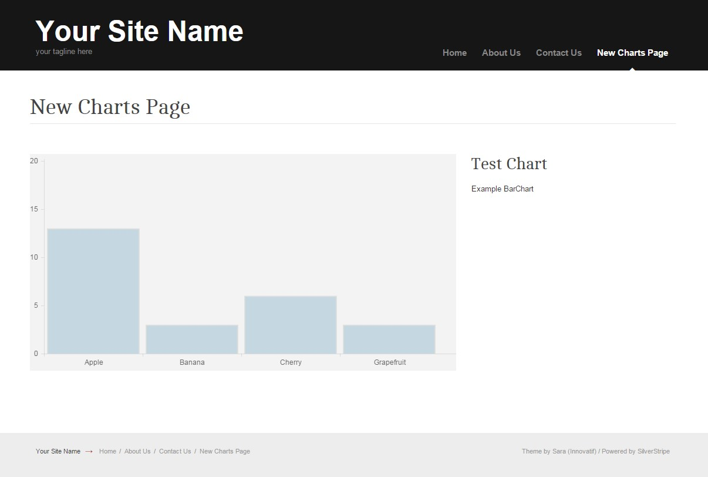

# SilverStripe Charts

[](https://travis-ci.org/flashbackzoo/silverstripe-charts)

This module provides a Charts Page pagetype, which can be used to present CSV data, via the [Chart.js](http://www.chartjs.org/) library.



There are currently two supported Chart types, Bar chart, and Pie chart.

NOTE: This module is still in development - so don't use it in production just yet :)

## Requirements

```
"php": ">=5.6",
"silverstripe/framework": "~3.1",
"silverstripe/cms": "~3.1",
"undefinedoffset/sortablegridfield": "0.4.3"
```

## Documentation

* [Developer docs](docs/en/index.md)
* [User guide](docs/en/user-guide.md)

## Contributing

See the [contributing](CONTRIBUTING.md) docs.
