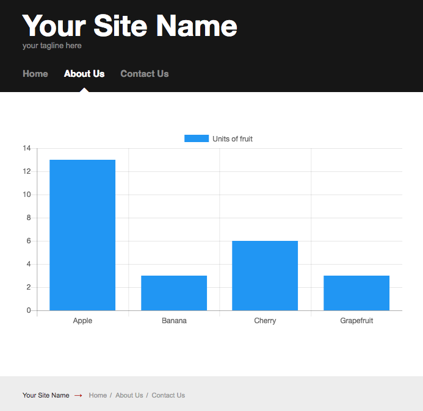

# SilverStripe Charts

Upload CSV files and present the data as [chart.js](http://www.chartjs.org/) charts using a shortcode.

## Requirements

* PHP ~5.6
* SilverStripe ~3.2

## Documentation

* [Developer docs](docs/en/index.md)
* [User guide](docs/en/user-guide.md)

## Contributing

See the [contributing](CONTRIBUTING.md) docs.
