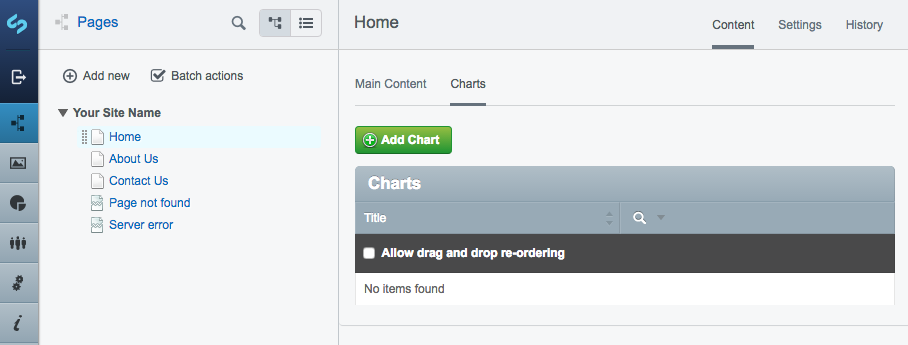

# User Guide

## Chart Data

Charts get their data from a CVS which you upload when creating a chart. The CSV requires the following column headings:

- Label: Used for labels
- Value: Used for totals

If your CSV includes other columns, that's fine, they will just be ignored.

Here is an example of a valid CSV file:

```
"Label","Value"
"Apple",13
"Banana",3
"Cherry",6
"Grapefruit",3
```

## Creating a chart

In the CMS, navigate to the page where you want the chart to appear, then select the "Charts" tab.



Click the "Add Chart" button then fill in the fields provided.


Once you have created your chart, copy the shortcode highlighted above.


Paste the shortcode into a content area, where you want the chart to appear on the page.

Save the page and your chart will appear.
