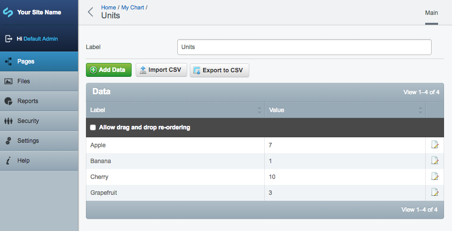
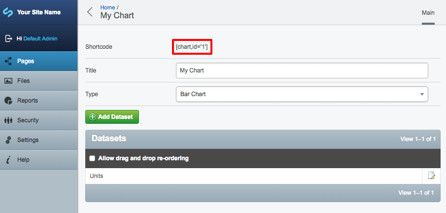
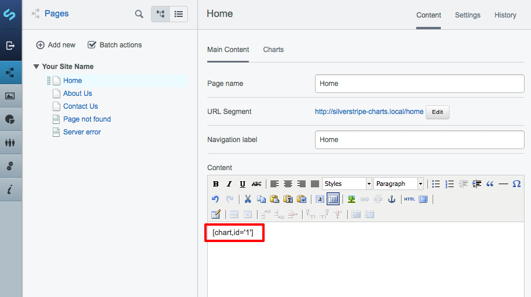

# User Guide

## Creating a chart

In the CMS, navigate to the page where you want the chart to appear, and select the "Charts" tab.

Each chart can have one or more datasets. Click the "Add Dataset" button to add a dataset.

You can add data to you dataset in two ways:

1. Use the "Add Data" button to add data one-by-one.
2. Use the "Import CSV" button to import data from a CSV file.

When importing data from CSV, you can choose which columns are mapped to "label" and "value" in the CMS, so don't worry if your data doesn't have these columns.

Once you've finished adding data, navigate back to the chart view, and copy the shortcode.

Paste the shortcode into a content area, save the page, and your chart will appear on the page.

